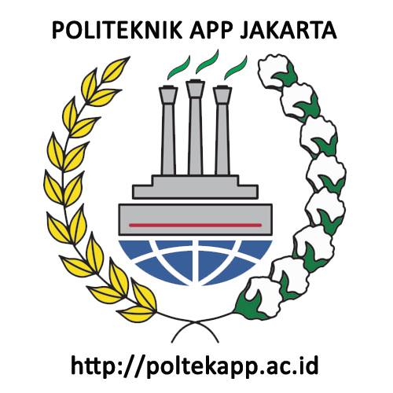
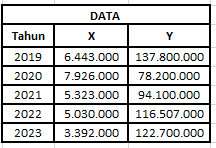
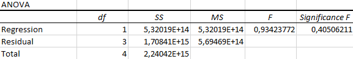

{fig-align="center"}

## Pendahuluan

### Latar belakang

Teh hijau merupakan salah satu komoditas ekspor unggulan Indonesia yang memiliki nilai ekonomi tinggi.
Permintaan global terhadap teh hijau terus meningkat karena tren gaya hidup sehat yang berkembang pesat.
Hal ini mendorong produsen di Indonesia untuk meningkatkan produksi guna memenuhi kebutuhan pasar internasional.
Namun, terdapat dinamika yang menarik untuk diteliti, yaitu sejauh mana ekspor teh hijau memengaruhi volume produksi domestik.
Penelitian ini berusaha mengkaji hubungan tersebut secara kuantitatif.

### Ruang lingkup

Penelitian ini akan memfokuskan pada analisis hubungan antara volume ekspor teh hijau (variabel independen) dan volume produksi teh di Indonesia (variabel dependen).
Data yang digunakan mencakup periode tahun tertentu dan bersumber dari lembaga resmi seperti Badan Pusat Statistik (BPS) dan Trademap.

### Rumusan masalah

1.  Bagaimana tren ekspor teh hijau Indonesia dalam beberapa tahun terakhir?
2.  Apakah terdapat hubungan signifikan antara ekspor teh hijau dan volume produksi domestik?
3.  Faktor-faktor apa saja yang memengaruhi hubungan tersebut?

### Tujuan dan manfaat penelitian

Penelitian ini bertujuan untuk:

• Menganalisis tren ekspor teh hijau Indonesia.

• Mengidentifikasi hubungan antara ekspor dan produksi teh hijau di Indonesia.

• Memberikan rekomendasi bagi pengambil kebijakan untuk meningkatkan sinergi antara ekspor dan produksi.

Manfaat dari penelitian ini adalah memberikan wawasan kepada pelaku industri teh dan pemerintah dalam mengembangkan strategi yang lebih efektif untuk meningkatkan daya saing teh hijau Indonesia di pasar global.

## Studi pustaka

Penelitian ini didasarkan pada teori perdagangan internasional yang menjelaskan bagaimana ekspor memengaruhi output domestik.
Beberapa studi sebelumnya telah menunjukkan hubungan positif antara ekspor dan produksi, terutama untuk komoditas yang memiliki permintaan tinggi di pasar global.
Literatur juga menyoroti pentingnya efisiensi produksi dan pengelolaan rantai pasok dalam mendukung ekspor yang berkelanjutan.

## Metode penelitian

### Data

{fig-align="center"}

{fig-align="center"}

Penelitian ini menggunakan data sekunder yang mencakup volume ekspor teh hijau (dalam kilogram) sebagai variabel independen (X) dan volume produksi teh domestik (dalam kilogram) sebagai variabel dependen (Y).
Data diambil dari sumber terpercaya dari Badan Pusat Statistik (BPS), Trademap, Databoks untuk periode 2019 hingga 2023.

### Metode analisis

Penelitian ini menggunakan regresi linear sederhana untuk menganalisis hubungan antara volume ekspor teh hijau (variabel independen) dan volume produksi teh domestik (variabel dependen).
Persamaan regresi yang digunakan adalah: • Hasil perhitungan menghasilkan persamaan , dengan koefisien determinasi sebesar 0,237.
Ini menunjukkan bahwa hanya 23,7% variasi dalam produksi teh yang dijelaskan oleh ekspor.
Nilai -value sebesar 0,405 mengindikasikan hubungan tidak signifikan.
• Analisis residual menunjukkan pola yang tidak teratur, yang berarti model regresi kurang cocok untuk menggambarkan hubungan ini.

## Pembahasan

### Pembahasan masalah

{fig-align="center"}

Hasil regresi menunjukkan bahwa hubungan antara volume ekspor teh hijau dan volume produksi teh domestik lemah, dengan sebesar 0,237.
Ini berarti hanya 23,7% variabilitas dalam volume produksi teh yang dapat dijelaskan oleh perubahan volume ekspor.
Koefisien regresi negatif (-6,8329) menunjukkan bahwa peningkatan volume ekspor cenderung diikuti oleh penurunan volume produksi, namun hasil ini tidak signifikan secara statistik (-value = 0,405).
Grafik residual memperlihatkan pola yang tidak beraturan, yang menunjukkan bahwa model regresi tidak sepenuhnya sesuai untuk menggambarkan hubungan antara kedua variabel.
Hasil ini juga dapat dipengaruhi oleh faktor eksternal, seperti kondisi pasar, kebijakan pemerintah, dan efisiensi produksi yang tidak dimasukkan dalam model.

### Analisis masalah

{fig-align="center"}

Meskipun produksi teh domestik meningkat antara 2020 hingga 2023, ekspor justru menurun.
Hal ini mungkin disebabkan oleh beberapa faktor.
Pertama, produsen mungkin lebih fokus memenuhi kebutuhan pasar domestik.
Kedua, keterbatasan kapasitas produksi menghalangi pemenuhan permintaan internasional.
Selain itu, harga teh di pasar global juga bisa mempengaruhi daya saing ekspor.

Untuk mengatasi hal ini, disarankan untuk memperluas pasar ekspor, meningkatkan efisiensi produksi melalui teknologi, dan memberikan insentif dari pemerintah untuk mendukung ekspor.
Pendekatan ini diharapkan dapat membantu meningkatkan volume ekspor teh hijau dan mendukung keberlanjutan produksinya.

## Kesimpulan

Hasil penelitian menunjukkan bahwa hubungan antara volume ekspor teh hijau dan volume produksi teh domestik di Indonesia cenderung lemah, dengan koefisien determinasi sebesar 0,237.
Hal ini menunjukkan bahwa hanya sebagian kecil variasi dalam produksi teh domestik yang dapat dijelaskan oleh perubahan dalam volume ekspor teh hijau.
Koefisien regresi negatif (-6,8329) menunjukkan bahwa peningkatan volume ekspor secara statistik tidak berkontribusi signifikan terhadap peningkatan produksi teh domestik.
Sebaliknya, tren data menunjukkan adanya prioritas pada pasar domestik dan tantangan dalam kapasitas produksi serta daya saing ekspor.
Berdasarkan temuan ini, diperlukan strategi yang lebih komprehensif untuk meningkatkan sinergi antara produksi dan ekspor, termasuk diversifikasi pasar, inovasi teknologi, dan dukungan kebijakan pemerintah.
Dengan demikian, diharapkan industri teh hijau Indonesia dapat meningkatkan daya saingnya di pasar global sambil tetap mendukung pertumbuhan produksi domestik secara berkelanjutan.

## Referensi

Cahyaningsih, Silvia.
(2023).
Analisis Daya Saing Ekspor Teh Indonesia di Pasar Internasional.
Universitas Batanghari Jambi.

Ronauli, Marcella, & Arka, Sudarsana.
(2023).
Pengaruh Produksi, Luas Areal Lahan, Kurs Dolar AS, dan Krisis Ekonomi Global terhadap Volume Ekspor Teh Indonesia Tahun 1987-2022.
Universitas Udayana.

Badan Pusat Statistik (BPS).
Statistik Teh Indonesia: Data Produksi dan Ekspor Teh Hijau Indonesia.
Jakarta: Badan Pusat Statistik.
Diperoleh dari https://www.bps.go.id.
